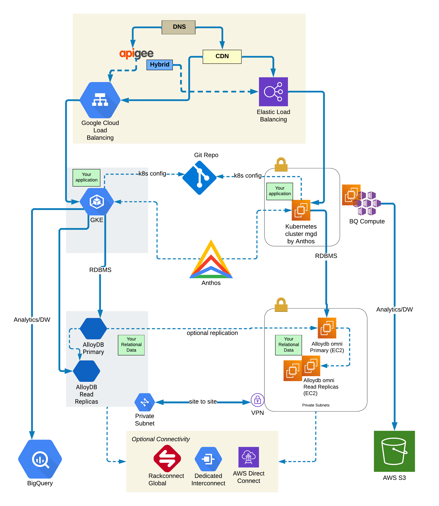

# gcp-multi-cloud-demo

## Overview

A multi cloud (AWS and GCP) design using Anthos and Alloy DB. In this article, we will deploy the following to demonstrate the multicloud capabilities of various Google Cloud products. This reference architecture is demonstrated on AWS and GCP but it can easily be extended to Azure,  on premise private cloud  or an edge data center. While this provides, a clear reference architecture for re-use the primary objective is to demostrate the art of the possible and/or a viable starting point for your design choices.  

At an high level, we will cover :-

 - Example applications that are deployed across two cloud (AWS, GCP) using a consistent GitOps deployment model delivered by Anthos Config Management (ACM).

 - An consistent database layer using Postgres compatible AlloyDB and AlloyDB Omni.

 - An Object storage model using both Google Cloud Storage (GCS) and Amazon S3.

 - Necessary cloud-vendor-native constructs like VPC and Load balancers.

 - Local testing options. 

 - The lessons we learnt in doing this, what worked well, what doesn't.

 - Step by Step deployment using Terraform, gcloud cli and Kubernetes cli.

From an implementation standpoint, the following get deployed at the end of this exercise :-

 - On GCP 
    - A GCP Project 
    - A custom VPC
    - An Anthos managed GKE cluster
    - Anthos Config management
    - Alloy DB Cluster
    - GCS buckets
    - GCP load balancer

 - On AWS 
    - An AWS account
    - A custom VPC
    - An Anthos managed Kubernetes cluster on EC2
    - Anthos Config management
    - AlloyDB cluster using Omni on EC2
    - VPN connectivity to GCP VPC
    - Elastic Load balancer (ELB)

Terraform will be used to provision all the infrastructure components. To demostrate the use of infrastructure, we will use three applications

 - A simple test-the-waters Wordpress application.

 - A custom application we wrote for demo purposes.

 - The micro services demo (Hipster Shop) application provided by GCP but tweaked to use AlloyDB as the database layer.

Anthos ACM will be used to deploy the Kubernetes manifests which are stored in GitHub. We will use kubectl to deploy the secrets required for the application.

### Presentation

Here are the slides from the Google Next presentation.

[TBC]


# Multi Cloud Reference Architecture  




The entire infrastructure for this solution can be deployed using Terraform. There are additional steps required for the application such as Kubernetes secrets which are included in the step-by-step instructions. Here are some notable mentions from the solution deployment.

- AlloyDB OMNI is still in Preview stage. It is a good time to experiment and learn while it moves to a GA stage. 

- Provisioning of AlloyDB takes time, about 15-30 minutes. Same is true for Kubernetes on AWS using Anthos. GKE on GCP is very quick.

- VPN has some gotchas in terms of single step provisioning because of a cyclic dependecy. This can be avoided using multi-stage deployment.

- Region selection is a tricky if you want to use Anthos and BQ Omni together. Due the different combination, the only regions in US that work for this reference are us-east4 in GCP and us-east-1 in AWS and eastus2 in Azure. If you drop the requirement for BQ OMNI, more options open up.  See [Big Query Omni Locations](https://cloud.google.com/bigquery/docs/locations#omni-loc) & [Anthos supported regions](https://cloud.google.com/anthos/clusters/docs/multi-cloud/aws/reference/supported-regions) for more details.


## Cost of the solution

This entiring testing infra will cost around 1600 USD if you run this for the **whole** month. If you plan to test this for few days, the cost will be significantly lower.
 
 - GCP
 
 	- AlloyDB is the most expensive component in this setup. 2 vCPU, 16 GB instance is close to 370 USD a month. If you add two read replicas, it comes to 900 USD in total. See [AlloyDB pricing](https://cloud.google.com/alloydb/pricing) fo details. 
 
 	- Kubernetes comes next with GKE around 200 USD for this test single cluster with 2 nodes.

 	- Anthos costs will come to 50 USD a month. Not this is only for the trial of Anthos. You can review [https://cloud.google.com/anthos/pricing/](https://cloud.google.com/anthos/pricing/) for the full details. 

 	- The rest are generally low ranging in 10s of USD

 	
 - AWS
 
 	- On AWS the cost is mostly around EC2 instances. For the test cases, we need 2 instances for AlloyDB and another 5 instances for Anthos Kubernetes Cluster (3 for control plane and 2 for worker nodes). Assuming `t2.large` for AlloyDB and `t3.medium` for AWS EC2 instances,  it comes to around 525 USD per month.	It is important to note that AWS and GCP is **not** an apples-to-apples comparison.  In case of GCP, you have a far superior Alloy DB setup and it is fully managed by GCP. With AWS, you are running it on EC2 and doing some of the management work. 

 	- The next biggest cost on AWS is the NAT gateway. 
 	
 	- The rest are generally low ranging in 10s of USD


# Future areas to explore

 - Build replication layer between the two clouds; primary in one cloud, read replicas in another and vice-versa. See [https://cloud.google.com/alloydb/docs/omni/set-up-read-replica](https://cloud.google.com/alloydb/docs/omni/set-up-read-replica)
 
 - Implement bi-directional sync using `gsutil` with GCS and S3 as the two locations 

 - Multicloud APIs - Use Apigee to deliver cross cloud API services

 - Extend this design to look at AI/ML services and [Kubeflow](https://www.kubeflow.org/)

 - Build a more robust dashboard using [Google Cloud Managed Prometheus](https://cloud.google.com/stackdriver/docs/managed-prometheus) 

 - Build a multi cloud publisher-subscriber using [Amazon Managed Streaming for Kafka](https://aws.amazon.com/msk/) and [Google Pub Sub](https://cloud.google.com/pubsub)


# Step by Step Deployment


## Pre-requisites and assumptions

  - Ensure you have the following tools instaled 
      - Terraform
      - [gcloud cli](https://cloud.google.com/sdk/docs/install)
      - [gke-gcloud-auth-plugin](https://cloud.google.com/sdk/docs/install-sdk)
      - [gsutil](https://cloud.google.com/storage/docs/gsutil_install)
      - [nomos](https://cloud.google.com/anthos-config-management/docs/how-to/nomos-command#installing)
      - [aws-cli](https://docs.aws.amazon.com/cli/latest/userguide/getting-started-install.html)
      - This has been tested on 
	      - Terraform 1.5.1
	      - gcloud
	        - Google Cloud SDK 416.0.0
	        - alpha 2023.01.30
	        - beta 2023.01.30
	        - core 2023.01.30
	        - gke-gcloud-auth-plugin 0.4.0
	        - gsutil 5.19
	        - nomos 1.14.0-rc.3
	      - aws-cli/2.10.0

## Environment Setup


  - Clone the repo . 
  
  ```
  git clone https://github.com/rax-incubate/gcp-mc-demo
  ```

  - Create a GCP project for this purpose. It is recomended you use a brand new Project to avoid any configuration conflict with existing resources. 

  - Ensure your cli environment and Terraform have access to this Project using GCP credentials.

  - Create an AWS Account this purpose. It is recomended you use a new Account to avoid any configuration conflict with existing resources. 

  - Ensure your cli environment and Terraform have access to this AWS Account using AWS credentials

  - Setup environment variables

  ```
  export MULTI_CLOUD_DEMO_GIT_REPO=<replace with your folder from the clone>
  export PROJECT_ID=<your GCP project>
  export AWS_ACCOUNT_NUMBER=<your AWS account number>
  ```

  - Setup your gcloud environment project
  
  ```
  gcloud config set project $PROJECT_ID
  ```

  - Enable services on the project. Terraform does this as well but some of this takes time and so best to do it before you run Terraform.
  
  ```
  for gcp_service in "cloudresourcemanager.googleapis.com" "iamcredentials.googleapis.com" "iam.googleapis.com" "monitoring.googleapis.com" "container.googleapis.com" "servicenetworking.googleapis.com" "artifactregistry.googleapis.com" "containersecurity.googleapis.com" "osconfig.googleapis.com" "alloydb.googleapis.com" "compute.googleapis.com" "gkehub.googleapis.com" "anthosconfigmanagement.googleapis.com" "gkemulticloud.googleapis.com" "gkeconnect.googleapis.com" "bigqueryconnection.googleapis.com" "anthos.googleapis.com" "connectgateway.googleapis.com" " analyticshub.googleapis.com"; do  gcloud services enable $gcp_service; done
  ```   

## Provision GCP and AWS Infrastructure

  - Create a GCP bucket for Terraform state.

  ```
  TF_STATE_BUCKET=<your bucket>
  gsutil mb -c standard -l us-east1  -p $PROJECT_ID gs://${TF_STATE_BUCKET}
  ```

  - Update the `state.tf` file with the right values from the above step

  - Review the template `template-terraform.tfvars` file and update it to your choices. The most critical values have "CHANGE-THIS" in the comments. The rest can be left as defaults. `variables.tf` has more details. Finally rename it to terraform.tfvars

  ```
  mv template-terraform.tfvars terraform.tfvars
  ```

  - Run terraform init, plan and apply

  ```
  export TF_VAR_env1_gcp_project=$PROJECT_ID && terraform init
  ```

  ```
  terraform apply
  ```
  
 - This provisions the infrastructure needed on AWS and GCP. This will take about 25-30 minutes. AlloyDB takes about 15 mins and Anthos on AWS can take some time as well. Go grab a beverage :-) 
 
 - Let's do some checks to make sure it worked.

  - Access the **GCP** cluster and ensure two nodes show up here. 
  
  ```
  export ENV1_CLUSTER_LOCATION=$(terraform output -raw env1_cluster_location)
  export ENV1_CLUSTER_NAME=$(terraform output -raw env1_cluster_name)
  ```
  
  ```
  gcloud container clusters get-credentials $ENV1_CLUSTER_NAME --location $ENV1_CLUSTER_LOCATION --project $PROJECT_ID
  ```
  
  ```
  kubectl get nodes
  
  ```
  
  - Sample output
  
  ```
  $ kubectl get nodes
  NAME                                        STATUS   ROLES    AGE   VERSION
  gke-env1-clu01-env1-pool-01-f57ef4fe-325x   Ready    <none>   16m   v1.26.5-gke.1200
  gke-env1-clu01-env1-pool-01-f57ef4fe-74z8   Ready    <none>   16m   v1.26.5-gke.1200
  ```
  
   - (Optional) - If you are doing this using a private Git repo you will need to provide secrets for authentication, perform the following steps. 

       - Get your GH PAT TOKEN from Github. See https://docs.github.com/en/authentication/keeping-your-account-and-data-secure/managing-your-personal-access-tokens for details

       - Setup Kubernetes secrets
      
       ```
       export GH_USERNAME=<your GH USER>
       export ACM_PAT_TOKEN=<your GH TOKEN>
       CM_NS=config-management-system
       ```
       
       ```
       kubectl get namespace | grep -q "^$CM_NS" || kubectl create namespace $CM_NS
       ```
               
       ```
       kubectl create secret generic git-creds \
          --namespace="config-management-system" \
          --from-literal=username=$GH_USERNAME \
          --from-literal=token=$ACM_PAT_TOKEN
       ```
 
      - Uncomment the following lines in `aws_anthos_acm.tf` and  `gcp_gke_acm.tf` under the `google_gke_hub_feature_membership` resource
       
       ```
       # sync_branch = var.env2_sync_branch
       # policy_dir  = var.env2_policy_dir
       # secret_type = "token"
       ```
       
       - Re-apply Terraform
       
       ```
       terraform apply
       ```        
 
  - Assuming you have not changed the git repo from the example, you should have the Wordpress pods running. You can also test the service using Kubectl proxy.

  ```
  kubectl -n wp get pods
  ```
  
  ```
  kubectl -n wp get service
  ```
  
  ```
  kubectl proxy --port 8888 &
  curl http://127.0.0.1:8888/api/v1/namespaces/wp/services/wordpress/proxy/wp-admin/install.php
  ```
  
  - Check status using ACM. Note, this sometimes takes 10-20 seconds. 

  ```
  gcloud alpha anthos config sync repo list --project $PROJECT_ID
  ```
  
  - Sample Output. Note you might see the AWS cluster begin with stalled and change.
  
  ```
  gcloud alpha anthos config sync repo list --project $PROJECT_ID
getting 1 RepoSync and RootSync from projects/gcp-mc-demo01/locations/global/memberships/env2-cluster
getting 1 RepoSync and RootSync from projects/gcp-mc-demo01/locations/global/memberships/membership-hub-env1-clu01
┌──────────────────────────────────────────────────────────────────────────┬───────┬────────┬─────────┬───────┬─────────┬─────────────┐
│                                  SOURCE                                  │ TOTAL │ SYNCED │ PENDING │ ERROR │ STALLED │ RECONCILING │
├──────────────────────────────────────────────────────────────────────────┼───────┼────────┼─────────┼───────┼─────────┼─────────────┤
│ https://github.com/rax-incubate/gcp-multi-cloud-demo.git//apps/env2@main │ 1     │ 1      │ 0       │ 0     │ 1       │ 0           │
│ https://github.com/rax-incubate/gcp-multi-cloud-demo.git//apps/env1@main │ 1     │ 1      │ 0       │ 0     │ 0       │ 0           │
└──────────────────────────────────────────────────────────────────────────┴───────┴────────┴─────────┴───────┴─────────┴─────────────┘
  ```


  - Access the **AWS** cluster and ensure two nodes show up here. 
  
  ```
  export ENV2_CLUSTER_LOCATION=$(terraform output -raw env2_cluster_location)
  export ENV2_CLUSTER_NAME=$(terraform output -raw env2_cluster_name)
  ```
  
  ```
  gcloud container aws clusters list --project $PROJECT_ID --location $ENV2_CLUSTER_LOCATION
  ```

  ```
  gcloud container aws clusters get-credentials $ENV2_CLUSTER_NAME --location $ENV2_CLUSTER_LOCATION --project $PROJECT_ID
  ```
  
  ```
  kubectl get nodes
  ```
  
   - (Optional) - If you are doing this using a private Git repo you will need to provide secrets for authentication, perform the following steps. 

       - Get your GH PAT TOKEN from Github. See https://docs.github.com/en/authentication/keeping-your-account-and-data-secure/managing-your-personal-access-tokens for details

       - Setup Kubernetes secrets
      
       ```
       export GH_USERNAME=<your GH USER>
       export ACM_PAT_TOKEN=<your GH TOKEN>
       CM_NS=config-management-system
       ```
       
       ```
       kubectl get namespace | grep -q "^$CM_NS" || kubectl create namespace $CM_NS
       ```
                
       ```
       kubectl create secret generic git-creds \
          --namespace="config-management-system" \
          --from-literal=username=$GH_USERNAME \
          --from-literal=token=$ACM_PAT_TOKEN
       ```
       
       - Uncomment the following lines in `aws_anthos_acm.tf` and  `gcp_gke_acm.tf` under the `google_gke_hub_feature_membership` resource
       
       ```
       # sync_branch = var.env2_sync_branch
       # policy_dir  = var.env2_policy_dir
       # secret_type = "token"
       ```
       
      - Re-apply Terraform
      ```
      terraform apply
      ```

  - Assuming you have not changed the git repo from the example, you should have the Wordpress pods running.

  ```
  kubectl -n wp get pods
  ```
  
  ```
  kubectl -n wp get service
  ```
  
  ```
  kubectl proxy --port 8888 &
  curl http://127.0.0.1:8889/api/v1/namespaces/wp/services/wordpress/proxy/wp-admin/install.php
  ```
  
  - Check status of ACM and Pods

  ```
  gcloud alpha anthos config sync repo list --project $PROJECT_ID
  ```
  
  
# Deploy Applications 

## Myapp - Anthos and AlloyDB - GCP 

In this section, we will make sure our custom application works. This application is already deployed using Anthos ACM but we need some additional DB setup and secrets configuration. The application creatively named "myapp" is a simple python APP that talks to AlloyDB table which contains information from the public IMDB database. To get to a working application, few steps are required. 
	

  - Make sure your kubectl context is set the GCP cluster
  
  - Create the secrets for the application.
  
  ```
  cd ${MULTI_CLOUD_DEMO_GIT_REPO}/infra/tf
  ```
  
  ```
  export ALLOYDB_PRIMARY_IP=$(terraform output -raw env1_db_prim_ip)
  export ALLOYDB_PRIMARY_PORT=5432
  export ALLOYDB_SCHEMA=imdb
  export ALLOYDB_SCHEMA_TABLE=title_basics
  export ALLOYDB_USER=myapp
  export ALLOYDB_USER_PWD=$(grep env1_alloydb_myapp_pwd terraform.tfvars  | cut -f 4 -d ' ' |  tr -d '"')
  export K8S_NAMESPACE=myapp
  ```

  ```
  kubectl create secret generic myapp-credentials \
          --namespace=$K8S_NAMESPACE \
          --from-literal=db_host=$ALLOYDB_PRIMARY_IP \
          --from-literal=db_host_port=$ALLOYDB_PRIMARY_PORT \
          --from-literal=db_name=$ALLOYDB_SCHEMA \
          --from-literal=db_table=$ALLOYDB_SCHEMA_TABLE \
          --from-literal=db_user=$ALLOYDB_USER \
          --from-literal=db_password=$ALLOYDB_USER_PWD
  ```
  
  - Check services and Pods for the application

  ```
  kubectl -n myapp get pods
  ```
  
  ```
  kubectl -n myapp get service
  ```

  - Access the URL from services 
  
  ```
  MYAPP_IP=$(kubectl get services -n $K8S_NAMESPACE myapp --output jsonpath='{.status.loadBalancer.ingress[0].ip}')
  ```
  
  ```
  curl http://$MYAPP_IP/run
  ```
  
  - Expected output

  ```
  $ curl http://$MYAPP_IP/run | head
  % Total    % Received % Xferd  Average Speed   Time    Time     Time  Current
                                 Dload  Upload   Total   Spent    Left  Speed
100 10210  100 10210    0     0  38396      0 --:--:-- --:--:-- --:--:-- 39269
env1-gcp<br>
tt0000001,short,Carmencita,Carmencita,False,1894,None,1,Documentary,Short<br>
tt0000002,short,Le clown et ses chiens,Le clown et ses chiens,False,1892,None,5,Animation,Short<br>
tt0000003,short,Pauvre Pierrot,Pauvre Pierrot,False,1892,None,4,Animation,Comedy,Romance<br>
tt0000004,short,Un bon bock,Un bon bock,False,1892,None,12,Animation,Short<br>
tt0000005,short,Blacksmith Scene,Blacksmith Scene,False,1893,None,1,Comedy,Short<br>
tt0000006,short,Chinese Opium Den,Chinese Opium Den,False,1894,None,1,Short<br>
tt0000007,short,Corbett and Courtney Before the Kinetograph,Corbett and Courtney Before the Kinetograph,False,1894,None,1,Short,Sport<br>
tt0000008,short,Edison Kinetoscopic Record of a Sneeze,Edison Kinetoscopic Record of a Sneeze,False,1894,None,1,Documentary,Short<br>
tt0000009,movie,Miss Jerry,Miss Jerry,False,1894,None,45,Romance<br>
  ```

## Myapp - Anthos and AlloyDB - AWS 


 - Change the kubectl context to AWS cluster. 

 - The core of the applications deployed on AWS is the same as GCP. However, there are some minor differences in the steps.

 - Setup the secrets in the K8s environment similar to the GCP. Note you need to switch context to the AWS cluster.
  
  ```
  cd ${MULTI_CLOUD_DEMO_GIT_REPO}/infra/tf
  ```
  
  ```
  export ALLOYDB_PRIMARY_IP=$(terraform output -raw env2_db_prim_ip)
  export ALLOYDB_PRIMARY_PORT=5432
  export ALLOYDB_SCHEMA=imdb
  export ALLOYDB_SCHEMA_TABLE=title_basics
  export ALLOYDB_USER=myapp
  export ALLOYDB_USER_PWD=$(grep env2_alloydb_myapp_pwd terraform.tfvars  | cut -f 4 -d ' ' |  tr -d '"')
  export K8S_NAMESPACE=myapp
  ```

  ```
  kubectl create secret generic myapp-credentials \
            --namespace=$K8S_NAMESPACE \
            --from-literal=db_host=$ALLOYDB_PRIMARY_IP \
            --from-literal=db_host_port=$ALLOYDB_PRIMARY_PORT \
            --from-literal=db_name=$ALLOYDB_SCHEMA \
            --from-literal=db_table=$ALLOYDB_SCHEMA_TABLE \
            --from-literal=db_user=$ALLOYDB_USER \
            --from-literal=db_password=$ALLOYDB_USER_PWD
  ```

  - Access the URL from services 
  
  ```
  MYAPP_IP=$(kubectl get services -n $K8S_NAMESPACE myapp --output jsonpath='{.status.loadBalancer.ingress[0].hostname}')
  ```
  
  ```
  curl http://$MYAPP_IP/run
  ```
   
  - Check services and Pods for the application

  ```
  kubectl -n myapp get pods
  ```
  
  ```
  kubectl -n myapp get service
  ```

  - Access the URL from services. If you face any issues see troubleshooting section
  
  ```
  MYAPP_IP=$(kubectl get services -n myapp myapp --output jsonpath='{.status.loadBalancer.ingress[0].hostname}')
  ``` 
  
  ```
  curl http://$MYAPP_IP/run
  ```
  
 - (Optional) If your Docker repo is private as it will be in most production use-cases, you need to grant access to the image in GCP Artifact registry. You also also use ECR if you want to upload a separate image to AWS repos and use AWS IAM. 
 
 	- Create an IAM policy and bind to a service account. Then create a secret using the generated key. 

	 ```
	 export ACCOUNT_NAME=aws-artifacts
	 export ARTIFACT_REGION=us-east1
	 ```
	 
	 ```
	 gcloud iam service-accounts create $ACCOUNT_NAME --project ${PROJECT_ID}
	 ```
	 
	 ```
	 gcloud projects add-iam-policy-binding ${PROJECT_ID} \
	  --member serviceAccount:${ACCOUNT_NAME}@${PROJECT_ID}.iam.gserviceaccount.com \
	  --role roles/artifactregistry.reader \
	  --project ${PROJECT_ID}
	 ```
	
	 ```
	 gcloud iam service-accounts keys create aws-registry-access-key.json \
	  --iam-account ${ACCOUNT_NAME}@${PROJECT_ID}.iam.gserviceaccount.com \
	  --project ${PROJECT_ID}
	 ```
	
	 ```
	 kubectl -n myapp create secret docker-registry registry-secret \
	  --docker-server=${ARTIFACT_REGION}-docker.pkg.dev \
	  --docker-username=_json_key \
	  --docker-email=${ACCOUNT_NAME}@${PROJECT_ID}.iam.gserviceaccount.com \
	  --docker-password="$(cat aws-registry-access-key.json)"
	 ```

## Bqapp - Anthos and BigQuery - GCP

 - The GCP side is quite easy as it is a application talking to Bigquery. The application manifests are in `env1/namespaces/mc-analytics/` but we need to create some configuration for this to work.

 - Create the table
 
 ```
 cd $MULTI_CLOUD_DEMO_GIT_REPO/apps/examples/mc-analytics/data
 ```
 
 ```
 bq mk --dataset ${PROJECT_ID}:mcdemogcp
 ```
 
 ```
 bq load --source_format=PARQUET mcdemogcp.cities cities.parquet
 ```
 
 - Test data import
 
 ```
 bq query --nouse_legacy_sql "SELECT continent, country.name as country_name, cb.array_element as city_name FROM mcdemogcp.cities, UNNEST(country.city.bag) cb"
 ```
 
 - Create Kubernetes service account

 ```
 export K8S_NAMESPACE=mc-analytics
 export BQAPP_GSA_NAME=bqappsa
 export BQAPP_GSA_ID=${BQAPP_GSA_NAME}@${PROJECT_ID}.iam.gserviceaccount.com
 ```

 ```
 kubectl create serviceaccount ${BQAPP_GSA_NAME} --namespace ${K8S_NAMESPACE}
 ```
 
  - Create the GCP service account
 
 ```
 gcloud iam service-accounts create ${BQAPP_GSA_NAME} --display-name=${BQAPP_GSA_NAME}
 ```
 
 ```
 gcloud projects add-iam-policy-binding ${PROJECT_ID} --member=serviceAccount:${BQAPP_GSA_ID} --role=roles/bigquery.user
 ```
 
 ```
 gcloud projects add-iam-policy-binding ${PROJECT_ID} --member=serviceAccount:${BQAPP_GSA_ID} --role=roles/bigquery.dataViewer
 ```

 ```
 gcloud iam service-accounts add-iam-policy-binding ${BQAPP_GSA_ID} \
    --member "serviceAccount:${PROJECT_ID}.svc.id.goog[$K8S_NAMESPACE/${BQAPP_GSA_NAME}]" \
    --role roles/iam.workloadIdentityUser
 ```
  

 - Create Kubernetes secrets. If you changed the dataset name, adjust it here.

 ```
 kubectl create secret generic bqapp-credentials \
          --namespace=$K8S_NAMESPACE \
          --from-literal=bq_dataset_id=mcdemogcp \
          --from-literal=bq_table_id=cities
 ```
 
 - Annotate the service account
 
 ```
 kubectl annotate serviceaccount ${BQAPP_GSA_NAME} \
    --namespace ${K8S_NAMESPACE} \
    iam.gke.io/gcp-service-account=${BQAPP_GSA_ID}
 ```
  
  - Restart the deployment
  
  ```
  kubectl rollout restart deployment bqapp -n ${K8S_NAMESPACE}
  ```
 	
  - Access the URL from services 
  
  ```
  BQAPP_IP=$(kubectl get services -n $K8S_NAMESPACE bqapp --output jsonpath='{.status.loadBalancer.ingress[0].ip}')
  ```
  
  ```
  curl http://$BQAPP_IP/run
  ``` 	

## Bqapp - Anthos and BigQuery - AWS

 - The AWS side is a bit more complicated but the main parts are the same

 - Rename the optional file.
 
 ```
 mv aws_bq.tf.optional aws_bq.tf
 ```
 
 - Edit `aws_bq.tf` to set the `env2_bq_data_bucket` to something unique. This is the bucket that will be created in S3 and will be used by Big query's external table.
 
 - Terraform apply.
 
 ```
 terraform apply
 ```
 
 - This creates the necessary IAM roles and connections for Big query.

 
 - Copy the data file to the s3 bucket

 ```
 cp $MULTI_CLOUD_DEMO_GIT_REPO/apps/examples/mc-analytics/data/cities.parquet s3://<YOUR BUCKET>/cities.parquet"
 ```
 
 
 - Create the Dataset.
 
 ```
 bq --location=aws-us-east-1 mk --dataset $PROJECT_ID:mcdemoaws
 ```
 
 - Edit `$MULTI_CLOUD_DEMO_GIT_REPO/apps/examples/mc-analytics/data/cities_aws.sql` and change the s3 bucket to match what you set above.

 - Create the external table in Big Query.

 ```
 cat $MULTI_CLOUD_DEMO_GIT_REPO/apps/examples/mc-analytics/data/cities_aws.sql  | bq query --use_legacy_sql=false
 ```
 
 - Test data import
 
 ```
 bq query --location=aws-us-east-1 --nouse_legacy_sql "SELECT continent, country.name as country_name, cb.array_element as city_name FROM mcdemoaws.cities, UNNEST(country.city.bag) cb"
 ```

 - Switch kubectl context to the AWS cluster 

 
 - Create Kubernetes service account

 ```
 export K8S_NAMESPACE=mc-analytics
 export BQAPP_GSA_NAME=bqappsa
 export BQAPP_GSA_ID=${BQAPP_GSA_NAME}@${PROJECT_ID}.iam.gserviceaccount.com
 ```

 ```
 kubectl create serviceaccount ${BQAPP_GSA_NAME} --namespace ${K8S_NAMESPACE}
 ```
 
 - Create Kubernetes secrets. If you changed the dataset name, adjust it here.

 ```
 kubectl create secret generic bqapp-credentials \
          --namespace=$K8S_NAMESPACE \
          --from-literal=bq_dataset_id=mcdemoaws \
          --from-literal=bq_table_id=cities
 ```
 
 - Annotate the service account
 
 ```
 kubectl annotate serviceaccount ${BQAPP_GSA_NAME} \
    --namespace ${K8S_NAMESPACE} \
    iam.gke.io/gcp-service-account=${BQAPP_GSA_ID}
 ```
  
  - Restart the deployment
  
  ```
  kubectl rollout restart deployment bqapp -n ${K8S_NAMESPACE}
  ```
 	
  - Access the URL from services 
  
  ```
  BQAPP_IP=$(kubectl get services -n myapp myapp --output jsonpath='{.status.loadBalancer.ingress[0].hostname}')
  ```
  
  ```
  curl http://$BQAPP_IP/run
  ``` 	

          
## Troubleshooting 

 - Anthos config sync issues. Start with `nomos`
 
 ```
 nomos status
 ```

 - Pod does not start
 
 	- Check the Docker image and make sure the Nodes have permissions to pull the image.
 	
 	- If you get a Config error, make sure the secrets are created in the right namespace.

 
 - Applicaton error
 
 	- Logs are you best helper for issues such a failing to connect to a DB.  If you are getting DB connection issues, login to the AlloyDB instance and make sure the users are created and the password provided is set. 
 
	 ```
	 kubectl -n myapp logs myapp-5fb55d89d9-vmlrq
	 ```
	 
 - Checking AlloyDB users. In our testing we had this fail a few times. There seems to be a delay in the password setting or it fails sometimes. If that happens, you may need to create the users using the following.
	 
	```
	export CLUSTER_NAME=env-db01
	export CLUSTER_REGION=us-east4
	```
	
	```
	gcloud alloydb users list \
	--cluster=$CLUSTER_NAME \
	--region=$CLUSTER_REGION \
	--project=$PROJECT_ID
	```
		
	```
	export ALLOY_USER=root
	export ALLOY_USER_PWD=dhfj4ifjfjfjfjfajsfs48DDFgwwr
	```
	
	```
	gcloud alloydb users create $ALLOY_USER \
	--password= $ALLOY_USER_PWD \
	--cluster=$CLUSTER_NAME \
	--region=$CLUSTER_REGION \
	--project=$PROJECT_ID
	```
		
	```
	gcloud alloydb users set-superuser $ALLOY_USER \
	--superuser=true \
	--cluster=$CLUSTER_NAME \
	--region=$CLUSTER_REGION \
	--project=$PROJECT_ID
	```

## Extras

### Microservices Demo


This uses the same demo provided by Google [https://github.com/GoogleCloudPlatform/microservices-demo](https://github.com/GoogleCloudPlatform/microservices-demo) but adjusts the configuration to use AlloyDB. The folder $MULTI_CLOUD_DEMO_GIT_REPO/apps/dev/gcp-examples/hs/ has two files; `namespace.yaml` and `resources.yaml` that deploys this application using Anthos config management. Before we trigger the deployment, we need to adjust the values for some variables.
  
  - Set the environment
 
  ```
  export PROJECT_ID=<your GCP project>
  export ALLOYDB_PRIMARY_IP=$(terraform output -raw env1_db_prim_ip)
  export ALLOYDB_DATABASE_NAME=carts
  export ALLOYDB_TABLE_NAME=cart_items
  export ALLOYDB_SECRET_NAME=alloydb-secret
  export ALLOYDB_USER_GSA_NAME=alloydb-user-sa
  export ALLOYDB_USER_GSA_ID=${ALLOYDB_USER_GSA_NAME}@${PROJECT_ID}.iam.gserviceaccount.com
  export CARTSERVICE_KSA_NAME=cartservice
  ```

  - Create the service account. 
 
  ```
  gcloud iam service-accounts create ${ALLOYDB_USER_GSA_NAME} --display-name=${ALLOYDB_USER_GSA_NAME}
  ```
  
  ```
  gcloud projects add-iam-policy-binding ${PROJECT_ID} --member=serviceAccount:${ALLOYDB_USER_GSA_ID} --role=roles/alloydb.client
  ```
  
  ```
  gcloud projects add-iam-policy-binding ${PROJECT_ID} --member=serviceAccount:${ALLOYDB_USER_GSA_ID} --role=roles/secretmanager.secretAccessor
  ```
  
  ```
  gcloud iam service-accounts add-iam-policy-binding ${ALLOYDB_USER_GSA_ID} \
    --member "serviceAccount:${PROJECT_ID}.svc.id.goog[default/${CARTSERVICE_KSA_NAME}]" \
    --role roles/iam.workloadIdentityUser
  ```

- Setup environment variable PGPASSWORD using the password of the initial super user in Terraform.
	
  ``` 
  export PGPASSWORD=$(grep env1_gcp_alloydb_initial_pwd terraform.tfvars  | cut -f 4 -d ' ' |  tr -d '"')
  echo $PGPASSWORD | gcloud secrets create ${ALLOYDB_SECRET_NAME} --data-file=-
  ```

  - Replace values in `resources.yaml`

  ```
  cd $MULTI_CLOUD_DEMO_GIT_REPO/apps/examples/hs/
  ```

  ```
  sed -i "s/PROJECT_ID_VALUE/${PROJECT_ID}/g" resources.yaml
  sed -i "s/ALLOYDB_PRIMARY_IP_VALUE/${ALLOYDB_PRIMARY_IP}/g"resources.yaml
  sed -i "s/ALLOYDB_USER_GSA_ID/${ALLOYDB_USER_GSA_ID}/g" resources.yaml
  sed -i "s/ALLOYDB_DATABASE_NAME_VALUE/${ALLOYDB_DATABASE_NAME}/g" resources.yaml
  sed -i "s/ALLOYDB_TABLE_NAME_VALUE/${ALLOYDB_TABLE_NAME}/g" resources.yaml
  sed -i "s/ALLOYDB_SECRET_NAME_VALUE/${ALLOYDB_SECRET_NAME}/g" resources.yaml
  ```

  - Move the folder with edited files to the folder under ACM

  ```
  mv $MULTI_CLOUD_DEMO_GIT_REPO/apps/examples/hs/ $MULTI_CLOUD_DEMO_GIT_REPO/apps/dev/env1/hs
  ```
  
  - Check services and Pods for the application

  ```
  kubectl -n hs get pods
  ```

  - Access the URL from services 
  
  ```
  MYAPP_IP=$(kubectl get services -n hs frontend-external --output jsonpath='{.status.loadBalancer.ingress[0].ip}')
  ```
  
  ```
  curl http://$MYAPP_IP/
  ```


### GCP TO AWS VPN

This is optional and only do this if you want VPN between the two Cloud regions. In a production setup, you will likely need to do this. This will also be required if you have private networks for replication.

  - Rename gcp_aws_vpn.tf.optional to gcp_aws_vpn.tf and then run terraform apply
  
  ```
  mv gcp_aws_vpn.tf.optional gcp_aws_vpn.tf
  ```
  
  ```
  terraform apply
  ```
  
  - Test VPN
  
  ```
  export ENV1_BASTION_IP=$(terraform output -raw env1_bastion_ip)
  export ENV2_BASTION_PRIV_IP=$(terraform output -raw env2_bastion_private_ip)
  ```
  
  ```
  ssh ubuntu@$ENV1_BASTION_IP curl -s -m 3 -v telnet://$ENV2_BASTION_PRIV_IP:22 2>&1 |grep Connected
  ```
  
  - Note VPN incurs a bit of cost and so if you don't need it, delete it
    
  ```
  mv gcp_aws_vpn.tf.optional gcp_aws_vpn.tf 
  ```
  
  ```
  terraform apply
  ```

### Alloydb OMNI on AWS

Note, these steps are provided to detail what is involved in AlloyDB setup on AWS. The terraform code in this repo takes care of this. So, if you are just running terraform apply, you don't need to do this.  The steps below are derived from the Google Cloud documentation at https://cloud.google.com/alloydb/docs/omni/install. These can also be used for a custom installation.

  - Make sure you are running an operating system with Linux Kernel version 4.18+ & cgroups2. Ubuntu 22.04 (Jammy) works for this. 

  - Install steps
  
  ```
  # Install Docker and pull Alloy DB images
  
  sudo apt update && sudo apt install -y apt-transport-https ca-certificates curl software-properties-common
  curl -fsSL https://download.docker.com/linux/ubuntu/gpg | sudo apt-key add -
  sudo add-apt-repository "deb [arch=amd64] https://download.docker.com/linux/ubuntu jammy stable"
  sudo apt install -y docker-ce 
  docker pull gcr.io/alloydb-omni/pg-service:latest
  docker pull gcr.io/alloydb-omni/memory-agent:latest

  # Install gcloud 
  sudo apt-get install -y apt-transport-https ca-certificates gnupg curl sudo
  echo "deb https://packages.cloud.google.com/apt cloud-sdk main" | sudo tee -a /etc/apt/sources.list.d/google-cloud-sdk.list
  curl https://packages.cloud.google.com/apt/doc/apt-key.gpg | sudo apt-key add -
  sudo apt-get update && sudo apt-get install -y google-cloud-cli 

  # Download the AlloyDB installer script and run it
  gsutil cp -r gs://alloydb-omni-install/$(gsutil cat gs://alloydb-omni-install/latest) .
  cd $(gsutil cat gs://alloydb-omni-install/latest)
  tar -xzf alloydb_omni_installer.tar.gz && cd installer
  sudo bash install_alloydb.sh

  # Setup disk
  mkfs.ext4 /dev/xvdbd
  mount /dev/xvdbd /data

  # Restart AlloyDB service
  sudo sed -i "s|^\(DATADIR_PATH=\).*|\1/data|" /var/alloydb/config/dataplane.conf
  sudo systemctl restart alloydb-dataplane
  sudo systemctl status alloydb-dataplane

  # Install net-tools and postgres client
  sudo apt-get install -y  net-tools postgresql-client
  
  ```


### AlloyDB Data Setup on GCP

  - (Optional) - Setup database and tables. These steps are executed using the AlloyDB Helper VM. They are provided here for review.

	  - Setup environment variable. PGPASSWORD is the password of the initial super user in Terraform. MYAPP_USER_PWD is any password you want to give the user for the myapp application
		
	  ``` 
	  cd ${MULTI_CLOUD_DEMO_GIT_REPO}/infra/tf
	  ```
	  
	  ```
	  export PGPASSWORD=$(grep env1_gcp_alloydb_initial_pwd terraform.tfvars  | cut -f 4 -d ' ' |  tr -d '"')
	  ```
	  
	  ```
	  export ALLOYDB_PRIMARY_IP=$(terraform output -raw env1_db_prim_ip)
	  ```
	  
	  ```
	  export MYAPP_USER=myapp
	  ```
	  
	  ```
	  export MYAPP_USER_PWD=$(grep env1_alloydb_myapp_pwd terraform.tfvars  | cut -f 4 -d ' ' |  tr -d '"')
	  ```
		
	  - Create a user for the application and grant privileges
		
	  ```
	  export ENV1_BASTION_IP=$(terraform output -raw env1_bastion_ip)
	  ```
	  
	  ```
	  psql -h ${ALLOYDB_PRIMARY_IP} -U root -c "CREATE USER ${MYAPP_USER} WITH LOGIN ENCRYPTED PASSWORD '"${MYAPP_USER_PWD}"'"
	  ```
	  
	  ```
	  psql -h $ALLOYDB_PRIMARY_IP -U root -c "ALTER USER myapp CREATEDB"
	  ```
	
	  - Setup the tables using the newly create user. Note, PGPASSWORD is now using the above password for the new user.
	  
	  ```
	  export PGPASSWORD=$(grep env1_alloydb_myapp_pwd terraform.tfvars  | cut -f 4 -d ' ' |  tr -d '"')
	  ```
	  
	  ```
	  psql -h $ALLOYDB_PRIMARY_IP -U myapp template1
	  ```
	  
	  ```
	  psql -h $ALLOYDB_PRIMARY_IP -U myapp -c "CREATE DATABASE imdb"
	  ```
	  
	  ```
	  psql -h $ALLOYDB_PRIMARY_IP -U myapp -c "CREATE TABLE title_basics(tconst varchar(12), title_type varchar(80), primary_title varchar(512), original_title varchar(512), is_adult boolean,start_year smallint, end_year smallint, runtime_minutes int, genres varchar(80))"
	  ```
	  ```
	  psql -h $ALLOYDB_PRIMARY_IP -U myapp -c "\copy title_basics FROM '/home/ubuntu/title.basics.tsv'"
	  ```
	  
	  ```
	  # Verify this worked
	  psql -h $ALLOYDB_PRIMARY_IP -U myapp imdb -c "SELECT * FROM title_basics LIMIT 5"
	  ```


### AlloyDB Data Setup on AWS


  - **(Optional)** - Setup database and tables. These steps are executed using the AlloyDB Ec2 VM. They are provided here for review.
 
  	- SSH into the AlloyDB primary instance.  
  
  	- Create a user
  
	  ```
	  export MYAPP_USER=myapp
	  ```
	  
	  ```
	  export MYAPP_USER_PWD =$(grep env2_alloydb_myapp_pwd terraform.tfvars  | cut -f 4 -d ' ' |  tr -d '"')
	  ```
	  
	  ```
	  psql -h ${ALLOYDB_PRIMARY_IP} -U postgres -c "CREATE USER ${MYAPP_USER} WITH LOGIN ENCRYPTED PASSWORD '"${MYAPP_USER_PWD}"'"
	  ```
	  
	  ```
	  psql -h${ALLOYDB_PRIMARY_IP}  -U postgres -c "ALTER USER ${MYAPP_USER} CREATEDB"
	  ```
	
	- Setup the table using the newly create user. Note, PGPASSWORD is now using the above password for the new user.
  
	  ```
	  ALLOYDB_PRIMARY_IP=127.0.0.1
	  export MYAPP_USER=myapp
	  export MYAPP_USER_PWD =$(grep env2_alloydb_myapp_pwd terraform.tfvars  | cut -f 4 -d ' ' |  tr -d '"')
	  export PGPASSWORD=$MYAPP_USER_PWD
	  ```
	  
	  ```
	  psql -h ${ALLOYDB_PRIMARY_IP} -U $MYAPP_USER template1 -c "CREATE DATABASE imdb"
	  ```
	  
	  ```
	  psql -h ${ALLOYDB_PRIMARY_IP} -U $MYAPP_USER imdb -c "CREATE TABLE title_basics(tconst varchar(12), title_type varchar(80), primary_title varchar(512), original_title varchar(512), is_adult boolean,start_year smallint, end_year smallint, runtime_minutes int, genres varchar(80))"
	  ```
	  
	  ```
	  mkdir -p /home/ubuntu/tmp 
	  ```
	  
	  ```
	  cd /home/ubuntu/tmp && gsutil cp gs://gcp-multi-cloud-demo/title.basics.tsv.gz .
	  ```
	  
	  ```
	  gzip -d title.basics.tsv.gz
	  ```
	  
	  ```
	  psql -h ${ALLOYDB_PRIMARY_IP} -U $MYAPP_USER imdb -c "\copy title_basics FROM '/home/ubuntu/tmp/title.basics.tsv'"
	  ```
	  
	  ```
	  # Verify
	  psql -h ${ALLOYDB_PRIMARY_IP} -U $MYAPP_USER imdb -c "SELECT * FROM title_basics LIMIT 5"
  	  ```

# REFERENCES
 
 - [https://github.com/terraform-google-modules/terraform-google-kubernetes-engine/blob/master/examples](https://github.com/terraform-google-modules/terraform-google-kubernetes-engine/blob/master/examples/)


 - [https://cloud.google.com/blog/topics/anthos/using-terraform-to-enable-config-connector-on-a-gke-cluster](https://cloud.google.com/blog/topics/anthos/using-terraform-to-enable-config-connector-on-a-gke-cluster)
  
 - [https://github.com/GoogleCloudPlatform/anthos-samples/tree/main/anthos-multi-cloud/AWS](https://github.com/GoogleCloudPlatform/anthos-samples/tree/main/anthos-multi-cloud/AWS)

 - [https://cloud.google.com/bigquery/docs/query-aws-data](https://cloud.google.com/bigquery/docs/query-aws-data)
 
 - [https://cloud.google.com/anthos/clusters/docs/multi-cloud/aws/how-to/use-workload-identity-aws](https://cloud.google.com/anthos/clusters/docs/multi-cloud/aws/how-to/use-workload-identity-aws)

